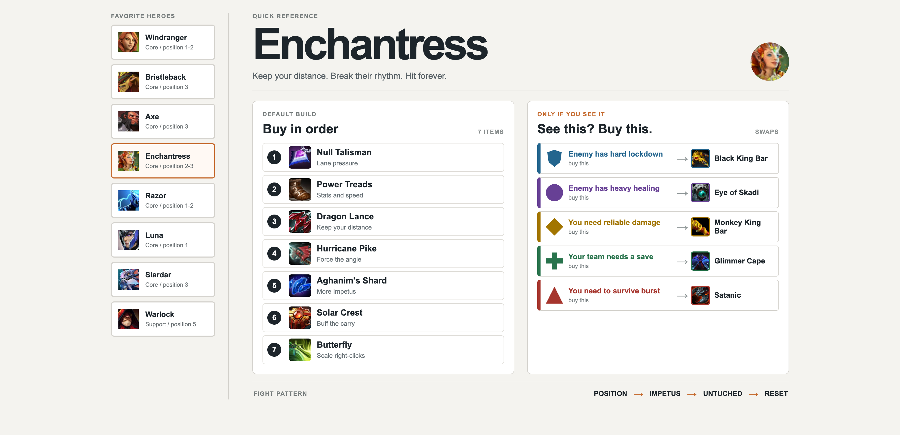

# Dota Cheatsheet

A compact Dota 2 hero and item reference built with SvelteKit and deployed to Cloudflare Workers.



## Development

Requirements: Bun and Wrangler authenticated with Cloudflare.

```bash
bun install
bun run dev
```

The local app runs at `http://localhost:8787`.

## Deploy

```bash
bun run build
bunx wrangler deploy
```

The Worker is named `dotacheatsheet`.

## API

List all guide data:

```text
GET /api/guides
```

Proxy a hero or item image from Dotabuff:

```text
GET /api/images/heroes/windranger
GET /api/images/items/blink-dagger
GET /api/images/items/eye-of-skadi
```

Image requests are limited to heroes and items in the guide catalog.
